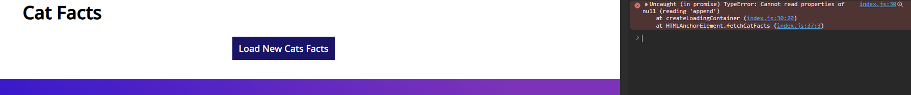

## Code Review Exercise

Write your code review here in markdown format.

### Bug #1

The form button doesn't work and therefore forms can't be submitted at all. This is an issue becuase it means the form is completely useless due to the fact that it can't submit anything. This can't really be shown in an image but you can just imagine the submit button not doing anything after clicking on it.

Initital code:

```html
<form id="RequestInfo" class="content-container form"></form>
```

Fixed code:

```html
<form
  id="RequestInfo"
  class="content-container form"
  action="/submit"
  method="post"
></form>
```

The submit and reset buttons weren't incased the form elements:

Initial code:

```html
    </form>
    <div
        class="form space-evenly-distributed-row-container form-buttons-container"
    >
        <input class="form-button" type="submit" value="submit" />
        <input class="form-button" type="reset" value="reset" />
    </div>

```

Fixed code:

```html
        <div
            class="form space-evenly-distributed-row-container form-buttons-container"
        >
            <input class="form-button" type="submit" value="submit" />
            <input class="form-button" type="reset" value="reset" />
        </div>
    </form>
```

Form submission working now with all form elements in the payload:


### Bug #2

The `Cats Facts` section breaks when you press the `Load New Cats Facts` button. Upon pressing the button, the entire section of facts disappear and no new facts are loaded.
From the console log, it appears that the container is null, and therefore can't append anything.

Image of bug:



Initial code:

```javascript
finally {
    const loading = document.querySelector(".loading-container");
    loading.setAttribute("class", "display-none");
  }
```

Fixed code:

```javascript
finally {
    const loading = document.querySelector(".loading-container");
    loading.classList.add("display-none");
  }
```

### Bug #3

The Navbar buttons don't work properly. They only properly navigate if you press on the text of the button but not anywhere else in the hover space.

Image of bug:


Initial code:

```css
.nav-list-item:hover {
  border: 2px solid var(--white);
  border-radius: 20px;
  cursor: pointer;
}
```

Replaced with:

```css
.nav-link:hover {
  border: 2px solid var(--white);
  border-radius: 20px;
  cursor: pointer;
  padding: 10px;
}
```

Fixed version:


Now I know that this fix didn't actually change the clickable area just the visual hover area to match the actual clickable area, but I couldn't figure out how to do it the other way, and I don't want to spend too much time on this.
