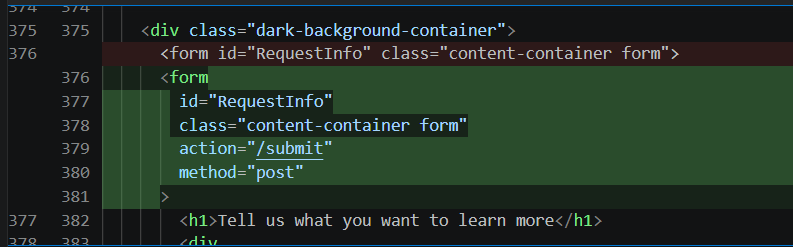
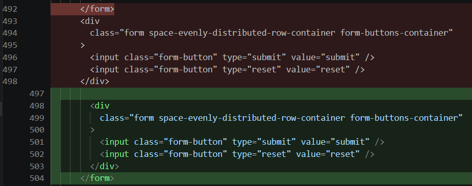
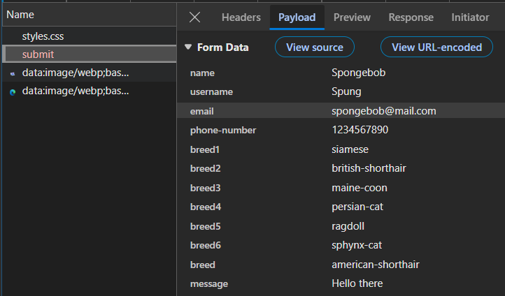

## Code Review Exercise

Write your code review here in markdown format.

### Bug #1

The form button doesn't work and therefore forms can't be submitted at all. This is an issue becuase it means the form is completely useless due to the fact that it can't submit anything. This can't really be shown in an image but you can just imagine the submit button not doing anything after clicking on it.

Initital and updated code via Git diff:

The submit and reset buttons weren't incased the form elements:

Form submission working now with all form elements in the payload:

